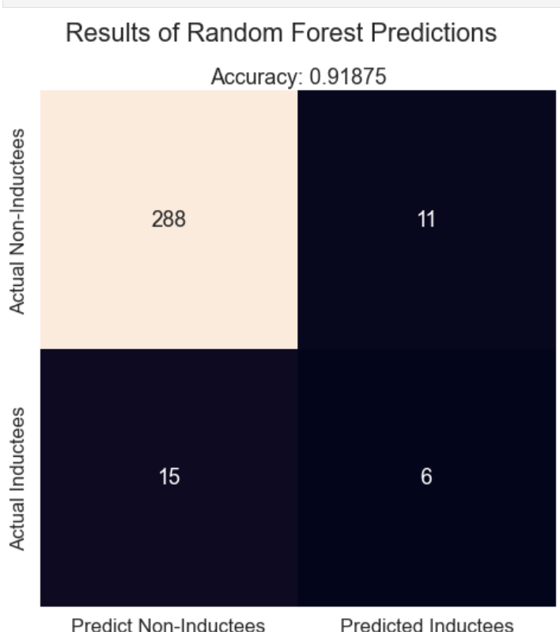
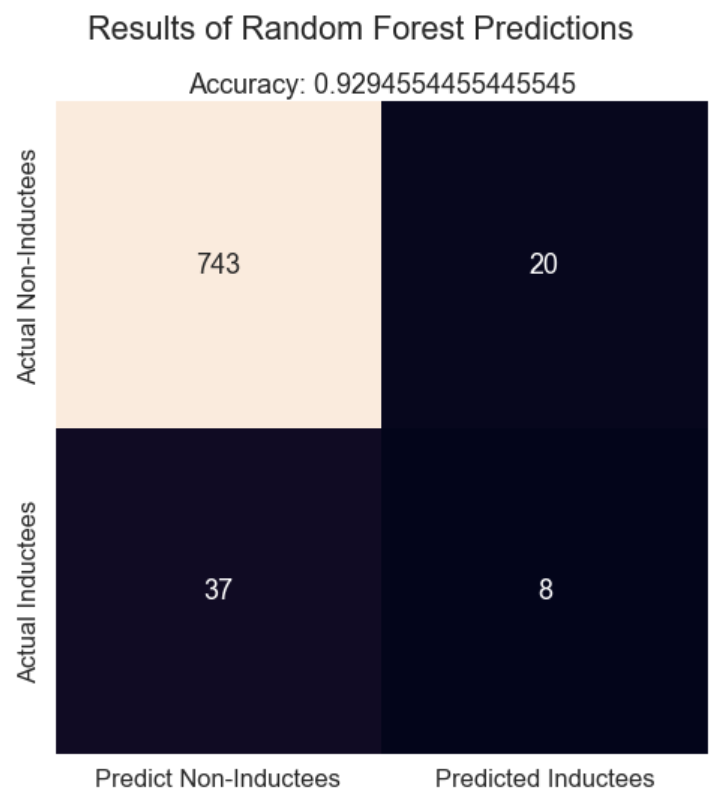

# GoldenGlovesFinalProject

## Topic:
When deciding on the focus of the project, we had two main objectives: first, we wanted to work with a topic that held our interests, and second, to find a topic with a reliable, accessibly large data source.  With the first objective in mind, we decided our project should be sports releated.  While there are many available sports databases, we concluded that baseball would best meet our needs.  All that was left was to figure out how to utilize our found data to our advantage. We decided to use the historical data to look at the stats of Baseball Hall of Fame nominees and inductees. 

## Data Sources:
Lahman Statistical Archive
https://www.seanlahman.com/baseball-archive/statistics/

## Hypothesis:
After reviewing the data, we developed our hypothesis that the Lahman statistical archive contains enough data to be able to predict which players will be inducted into the Hall of Fame (HOF). We will test our hypothesis by using aggregated stats for each player in regard to batting, fielding, and pitching. Using this data we can attempt to predict hall of fame status using a classificication machine learning method.

## Approach:
With our data found and hypothesis formed, we dived into the project by first creating our databases.  We used Python to create databases by merging data sources, trimming unnecessary and noisy data, and forming smaller, focused databases to in order to maximize our Machine Learning results. We continued to use Python for Machine Learning to determine from current Hall of Famers if there are any trends in the Lahmen statistics and use either deep learning or random forrest classification to help answer the hypothesis and apply that to future Hall of Fame candidates. For visualizaion, we used Tableau.  Finally, to display our project, we created webpages through JavaScript.

## Machine Learning:
### Why Random Forest?
Random Forest proved to be the model that most accurately predicted inductee status without blanket predicting nobody was inducted.

### Preprocessing:
Before learning with the data, we dropped columns that contained inconsitent data. In addition, we dropped all HOF nominees who were not players. Finally, we built a pipeline that uses SMOAT to oversample the data - This is done to enable the model to have more training data to learn trends in the rare occurence someone is inducted into the HOF.

### Lessons Learned:
   - Originally we tried using Logistic Regression, however this ended up being extremely inaccurate - with an accuracy score of 12% once it was properly working. Very low accuracy and recall values.
   - After this we attempted to use a deep neural network. This model was immediately more accurate, however upon further investigation we found this was only due to it predicting that nobody was inducted to the HOF. It could not predict the rare circumstance. High accuracy and bad recall.
   - Next was our first iteration of Random Forest Classification, the model was fairly accurate from the start, but didn't make sense when dug into further. The reason behind this was we were feeding in too many columns of data, as we had combined our batting, fielding, and pitching tables all into one. This doesn't work, as players can be inducted soley on one of these tables, and be average on the others.
  - Finally we seperated our datasets again and ran the Random Forest Model on all of them independantly. This resulted in both the confusion matrixes and feature importances of the predictions looking significantly better. This finally resulsted in precision, recall, and accuracy being greater then 90.
  

## Statistics and Summary
   - We discovered that the batting statistics were the most important statistic for prediction for induction to the HOF. The batting database also produced the most accurate random forest model, with a rate of almost 95%. 

   - Upon analyzing the pitching statistics, we found that stike-outs carry the most weight within the category and the random forest model we ran weilded a high accuracy of almost 92%.

   - Last, but not least, we found that the fielding data was the least important statistic when determining whether a player would be inducted, when compared to batting and pitching. These stats seemed to be most relevant only if a player had 2000 games and 20 years in the league. Nevertheless, our random forest model resulted in an accuracy of almost 93%.

   Overall, based on our random forest models, we feel we did prove our hypothesis and baseball players' chances of being inducted into the Hall of Fame can potentially be predicted based off of their batting, pitching, and or fielding statistics.

